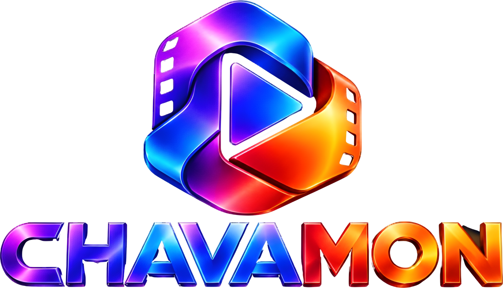
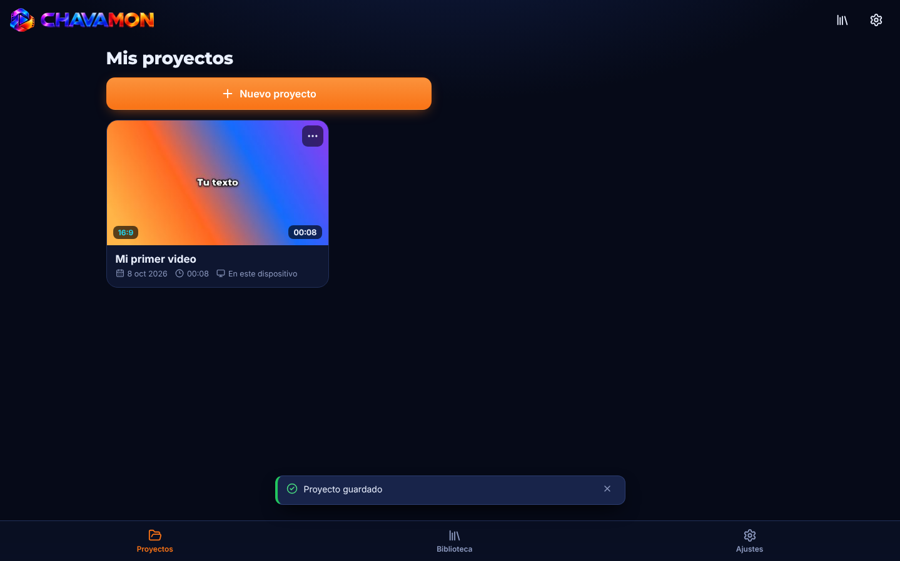
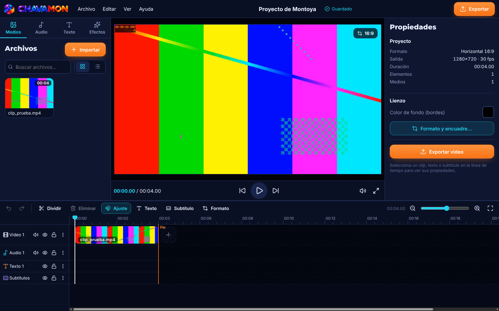
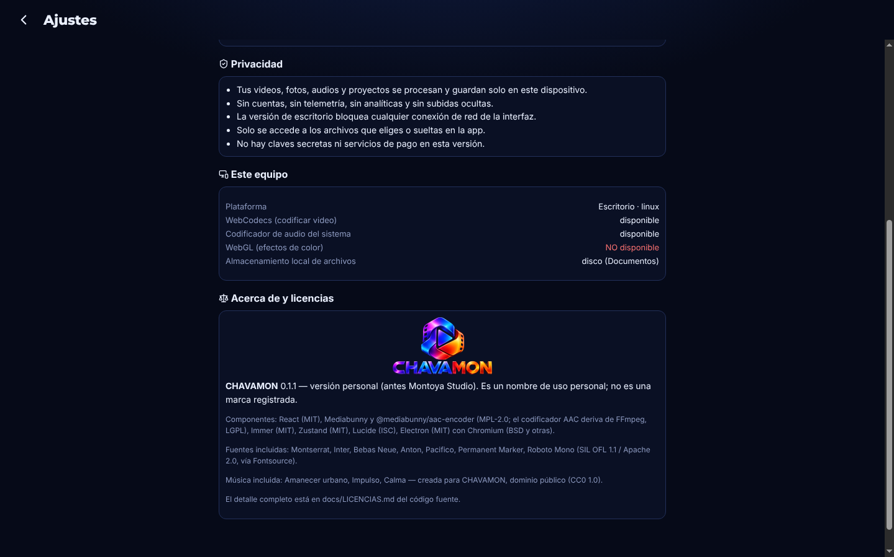
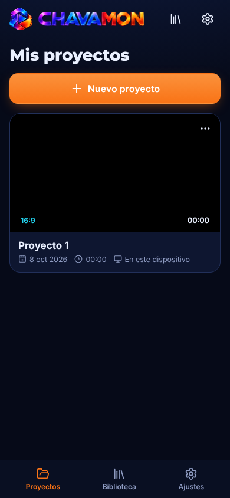

<p align="center">
  
</p>

<p align="center"><b>Editor de video local para escritorio.</b> Tus videos se editan y se guardan en tu equipo: sin cuentas, sin telemetría y sin subidas ocultas.</p>

---

## Capturas

| Inicio | Editor |
|---|---|
|  |  |

| Ajustes y privacidad | Pantalla angosta |
|---|---|
|  |  |

## Qué hace

- **Proyectos** con guardado automático, copia de respaldo y recuperación si la app se cierra mal.
- **Importar** video, foto y audio (botón o arrastrar y soltar).
- **Línea de tiempo** con pistas de video, audio, texto y subtítulos: dividir, eliminar, ajuste magnético, ocultar, silenciar y bloquear pistas.
- **Velocidad** del clip de 0.25x a 4x.
- **Texto y subtítulos** con fuentes incluidas, y exportación de subtítulos SRT.
- **Formatos** 16:9 (YouTube), 9:16 (TikTok, Reels, Shorts) y 1:1, con encuadre.
- **Exportar MP4** en 720p, 1080p, 1440p o 4K, a 24, 25, 30 o 60 fps.
- **Biblioteca** con música libre (CC0) y tus propios audios.
- **Paquetes de efectos** en JSON validado: solo datos, nunca se ejecuta código ([formato](docs/FORMATO_PAQUETES.md)).

## Privacidad

- Todo se procesa y se guarda solo en tu equipo.
- La versión de escritorio bloquea cualquier conexión de red de la interfaz.
- Solo se accede a los archivos que eliges o sueltas en la app.
- No hay claves secretas ni servicios de pago.

## Tecnología

Electron 44 · React 19 · Mediabunny (codificación con WebCodecs) · Zustand · Immer · Lucide · Vite.

La ventana corre aislada (`contextIsolation` + `sandbox`) y se comunica con el sistema por un puente con lista blanca de canales.

## Descargar

Página: **https://chavamon.vercel.app** (con el editor web en `/app/`).

Los instaladores están en [Releases](https://github.com/AlfonsoCha1/CHAVAMON_BASICO/releases):

| Sistema | Archivo |
|---|---|
| Windows 10/11, 64 bits | `CHAVAMON-<versión>-windows-x64.exe` y versión portátil `.zip` |
| Windows 11 ARM64 | `CHAVAMON-<versión>-windows-arm64.exe` |
| Windows 32 bits | `CHAVAMON-<versión>-windows-ia32.exe` |
| Linux (Mint, Ubuntu, Debian) | `CHAVAMON-<versión>-linux-amd64.deb` y `.AppImage` |
| Navegador | `CHAVAMON-<versión>-web.zip` |

Los arma el flujo [Instaladores](.github/workflows/instaladores.yml) cuando se publica un release. Antes de subirlos, prueba la app ya instalada en Windows y en Ubuntu: abre, importa un clip y exporta un MP4.

## Probarlo desde el código

Este repositorio contiene la **versión compilada** de la app (la interfaz ya empaquetada con Vite y el proceso principal de Electron). Para abrirla necesitas [Node.js](https://nodejs.org):

```bash
npx electron@44.5.1 .
```

Tus proyectos se guardan en `Documentos/CHAVAMON`.

## Créditos y licencias

© 2026 Alfonso Chavarín. Todos los derechos reservados. CHAVAMON es un nombre de uso personal; no es una marca registrada.

Componentes de terceros y sus licencias: [docs/LICENCIAS.md](docs/LICENCIAS.md).
